# ☁️ AWS Hands-on Learning Project (EC2 + RDS + Cloud Setup)

## 📌 Project Overview

This repository documents my hands-on learning and implementation while following an AWS practical tutorial.

The goal of this project was to understand **real-world cloud infrastructure deployment** using Amazon Web Services by creating compute resources, configuring networking, and deploying applications on cloud instances.

This project helped me gain practical exposure to cloud fundamentals and DevOps workflows.

---

## 🚀 Services Used

- Amazon EC2  
- AWS IAM  
- Security Groups  
- SSH Key Management  
- Linux Server Configuration  
- Web Server Deployment  
- Cloud Networking Basics  

---

## 🏗️ Architecture
Local Machine
│
▼
SSH Connection
│
▼
AWS EC2 Instance
│
▼
Apache Web Server
│
▼
Public Web Access


---

## ⚙️ Implementation Steps

### ✅ 1. AWS Account Setup
- Created AWS account
- Configured IAM access
- Selected AWS region

---

### ✅ 2. EC2 Instance Creation
- Launched Linux EC2 instance
- Selected instance type
- Created key pair (.pem)
- Configured inbound rules

---

### ✅ 3. Security Group Configuration
- Allowed SSH (Port 22)
- Allowed HTTP (Port 80)

---

### ✅ 4. SSH Connection

Connected EC2 from local system:

```bash
ssh -i key.pem ubuntu@public-ip

sudo apt update
sudo apt install apache2 -y
```

---

# 📸 Day 35 — Implementation Screenshots

## AWS Setup & Deployment Steps

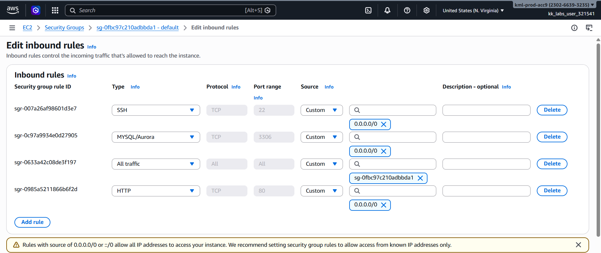

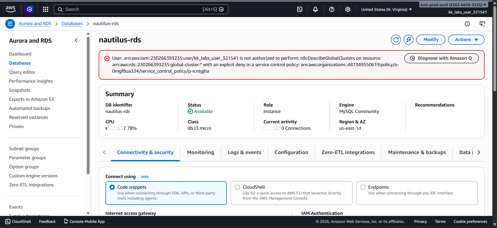

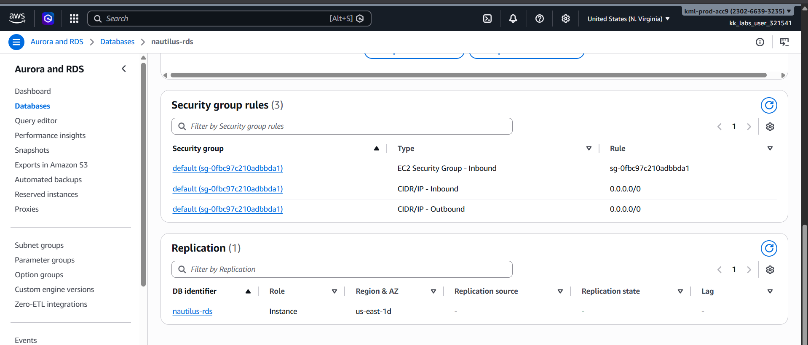

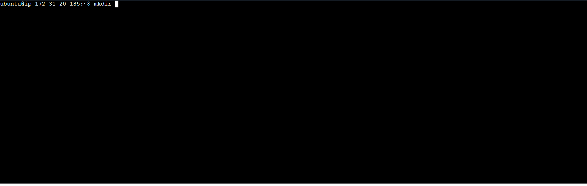

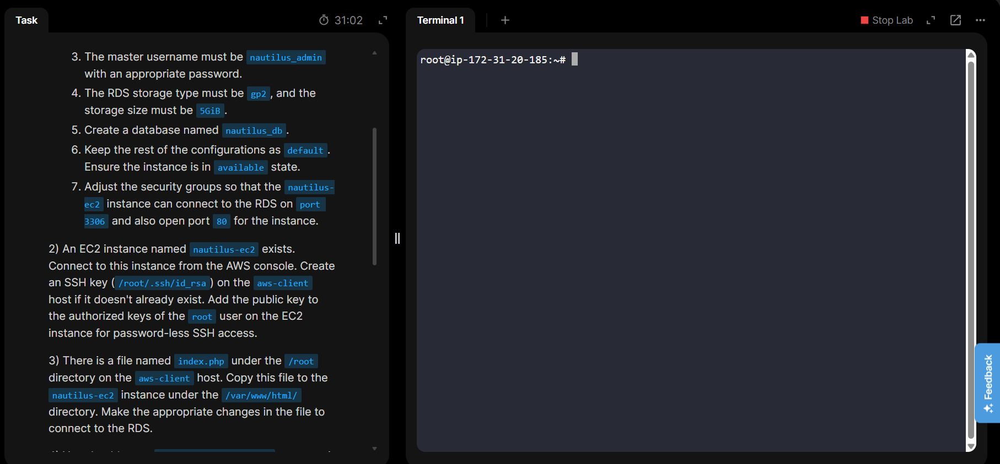

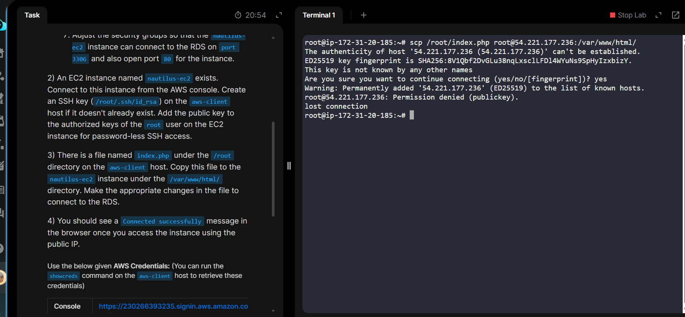

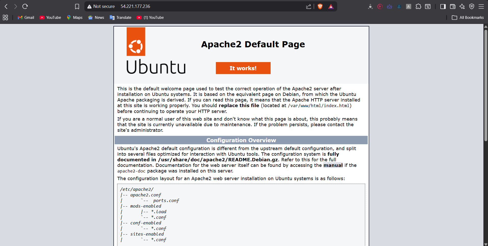

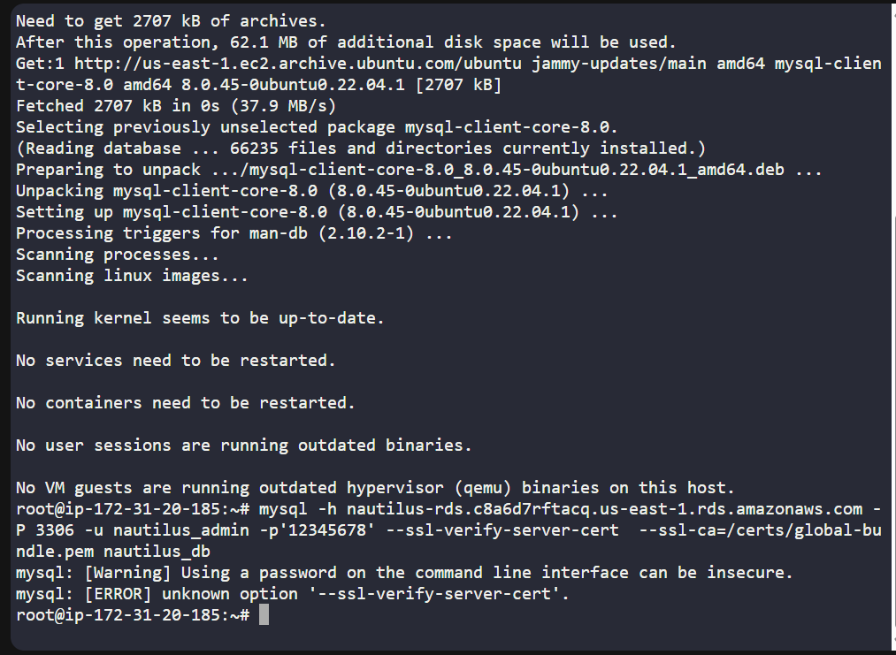

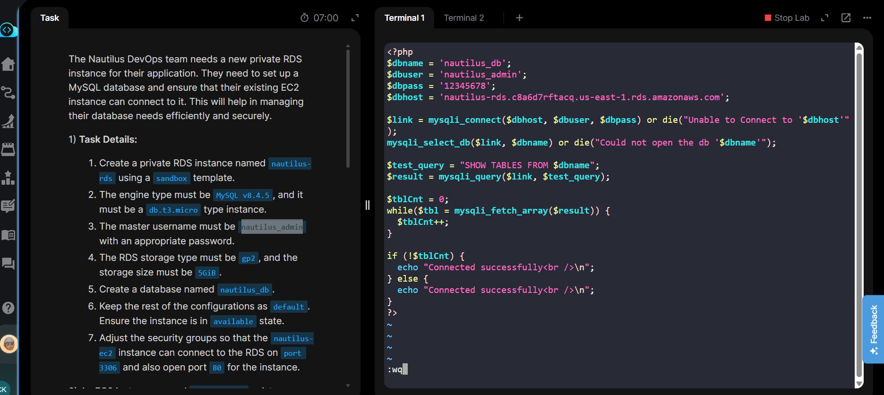

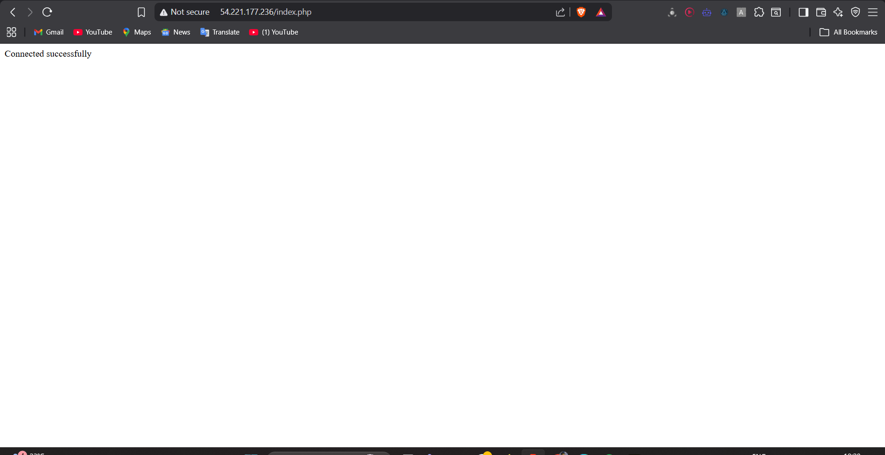

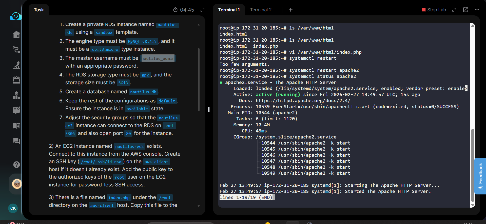

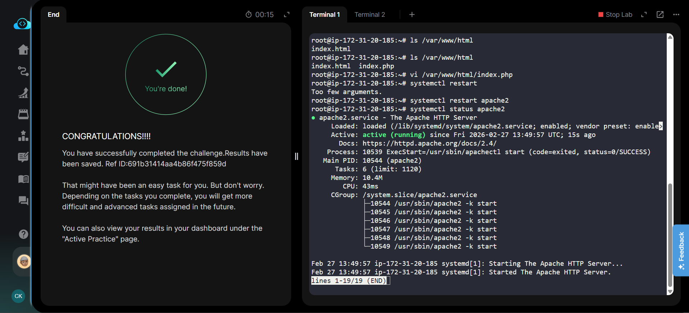
