# 🚀 AWS DevOps Project: EC2 + Application Load Balancer with Nginx

## 📌 Project Overview

This project demonstrates how to deploy a scalable web application infrastructure on AWS using **Amazon EC2** and an **Application Load Balancer (ALB)**.

An Ubuntu EC2 instance is configured automatically using **User Data scripts** to install and run **Nginx**. The instance is registered in a **Target Group**, and the **Application Load Balancer** routes incoming HTTP traffic to the EC2 instance.

This setup improves **availability, scalability, and traffic management**.

---

## 🏗 Architecture

```
Internet
   │
   ▼
Application Load Balancer (devops-alb)
   │
   ▼
Target Group (devops-tg)
   │
   ▼
EC2 Instance (devops-ec2)
   │
   ▼
Nginx Web Server
```

---

## ⚙️ Technologies Used

* AWS EC2
* AWS Application Load Balancer
* AWS Target Groups
* AWS Security Groups
* Ubuntu Linux
* Nginx Web Server

---

## 📋 Project Requirements

* Create a Security Group named **devops-sg**
* Launch an **Ubuntu EC2 instance**
* Install and start **Nginx using user data**
* Create an **Application Load Balancer**
* Create a **Target Group**
* Register the EC2 instance in the target group
* Route HTTP traffic through the ALB

---

# 🧩 Step 1: Create Security Group

Create a security group **devops-sg** to allow HTTP traffic.

### Inbound Rules

| Type | Protocol | Port | Source                 |
| ---- | -------- | ---- | ---------------------- |
| HTTP | TCP      | 80   | Default Security Group |

This allows the **Load Balancer to communicate with the EC2 instance**.

---

# 🧩 Step 2: Launch EC2 Instance

Create an EC2 instance with the following configuration.

| Parameter      | Value         |
| -------------- | ------------- |
| Name           | devops-ec2    |
| AMI            | Ubuntu Server |
| Instance Type  | t2.micro      |
| Security Group | devops-sg     |
| VPC            | Default VPC   |

---

# 🧩 Step 3: Configure User Data Script

During instance launch, add the following **User Data Script**.

```bash
#!/bin/bash
apt update -y
apt install nginx -y
systemctl start nginx
systemctl enable nginx
```

### Purpose

This script automatically:

* Updates packages
* Installs **Nginx**
* Starts the **Nginx service**
* Enables Nginx at boot

---

# 🧩 Step 4: Create Target Group

Create a target group to route traffic to the EC2 instance.

| Setting     | Value     |
| ----------- | --------- |
| Target Type | Instance  |
| Protocol    | HTTP      |
| Port        | 80        |
| Name        | devops-tg |

Register the instance:

```
devops-ec2
```

Health check configuration:

| Setting  | Value        |
| -------- | ------------ |
| Protocol | HTTP         |
| Path     | /            |
| Port     | traffic port |

---

# 🧩 Step 5: Create Application Load Balancer

Create an **Application Load Balancer**.

| Setting | Value           |
| ------- | --------------- |
| Name    | devops-alb      |
| Scheme  | Internet-facing |
| IP Type | IPv4            |

### Configure Availability Zones

Select **two Availability Zones** and their subnets.

Example:

```
us-east-1a
us-east-1e
```

---

# 🧩 Step 6: Configure Listener

Configure the ALB listener.

| Protocol | Port | Action               |
| -------- | ---- | -------------------- |
| HTTP     | 80   | Forward to devops-tg |

This allows traffic to flow from the internet to the target group.

---

# 🧩 Step 7: Security Group for ALB

The **default security group** attached to the ALB must allow inbound traffic.

### Inbound Rules

| Type | Protocol | Port | Source    |
| ---- | -------- | ---- | --------- |
| HTTP | TCP      | 80   | 0.0.0.0/0 |

This allows internet users to access the load balancer.

---

# 🧪 Testing the Setup

Copy the **ALB DNS Name**:

```
http://devops-alb-xxxxx.us-east-1.elb.amazonaws.com
```

Open it in a browser.

Expected output:

```
Welcome to nginx!
```

---

# 📊 Key AWS Concepts Demonstrated

This project demonstrates important DevOps and AWS concepts:

* Infrastructure setup on AWS
* Load balancing using ALB
* Automatic server configuration using User Data
* Security group configuration
* Health checks and target registration
* High availability architecture

---

# � Day 36 — Implementation Screenshots

## AWS Setup & Deployment Steps

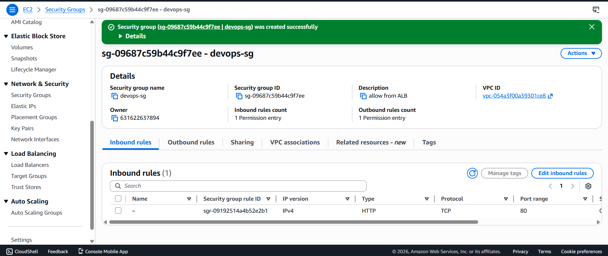

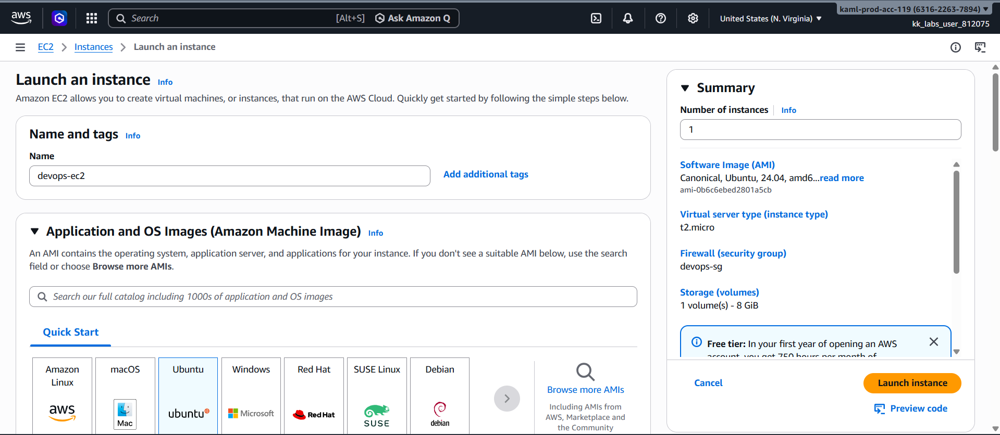

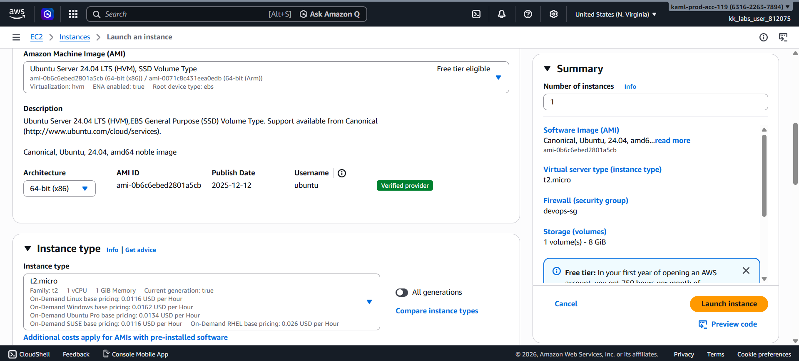

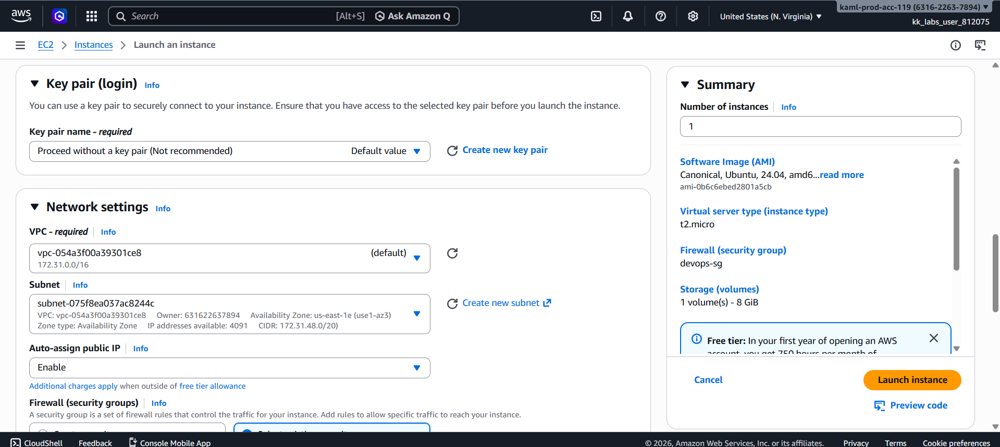

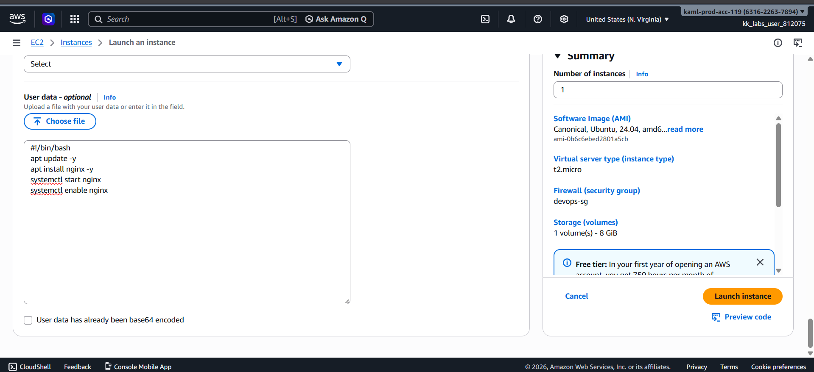

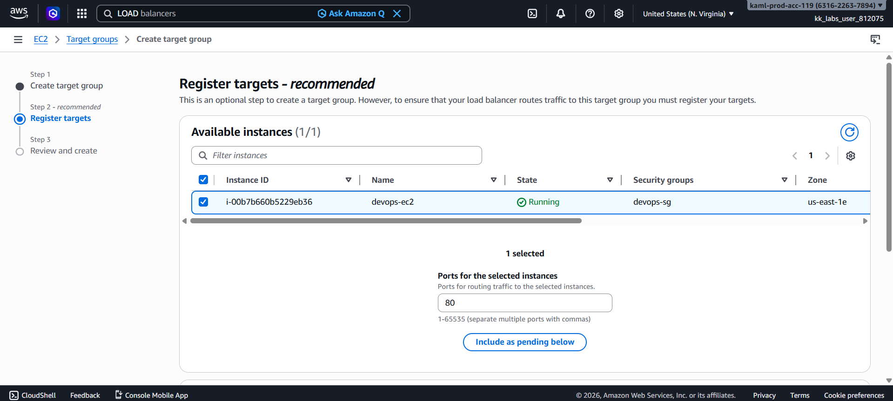

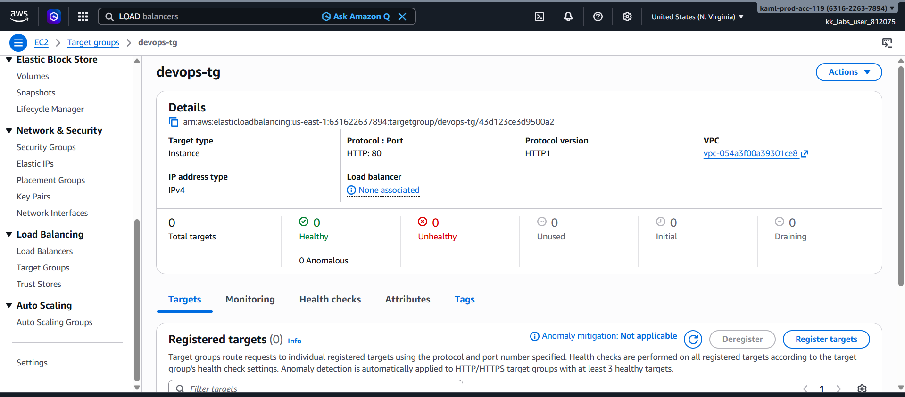

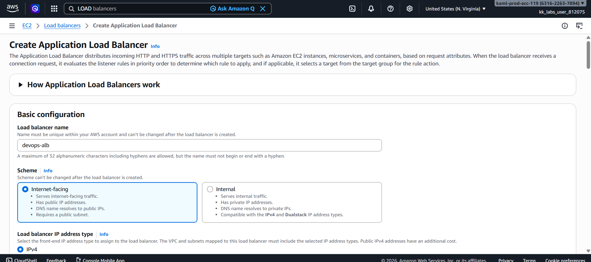

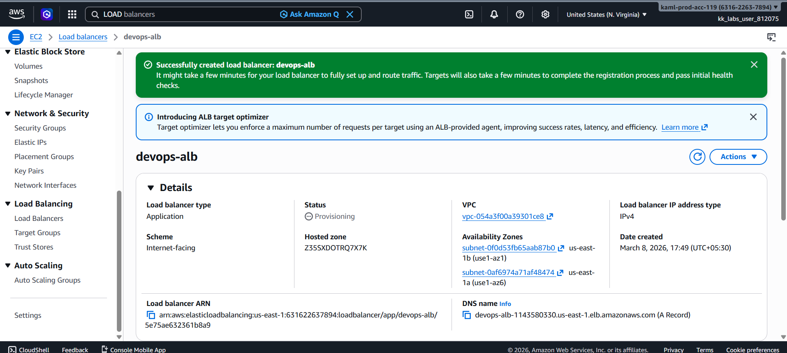

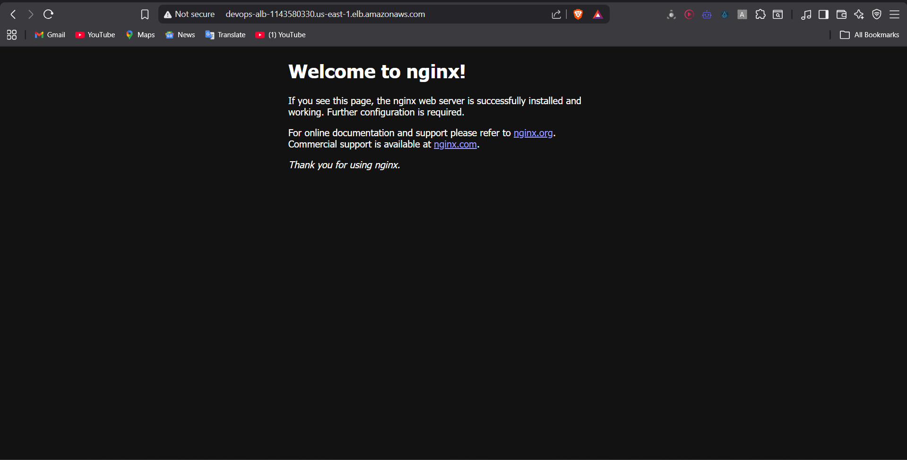

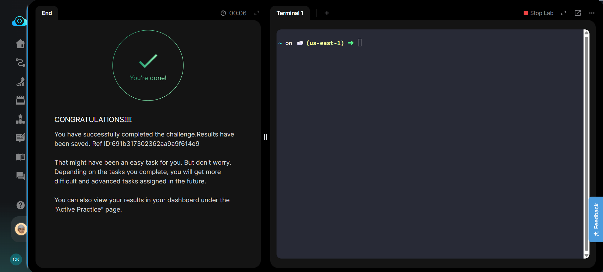

---

# 🎯 Learning Outcome

Through this project I learned:

* How to deploy servers using **AWS EC2**
* How to configure **Application Load Balancers**
* How **Target Groups and Health Checks** work
* How to secure infrastructure using **Security Groups**
* How to automate server setup with **User Data scripts**

---

# 📌 Future Improvements

* Add **Auto Scaling Group**
* Deploy multiple EC2 instances
* Add HTTPS using **AWS Certificate Manager**
* Use **Terraform for infrastructure automation**

---

# 👨‍💻 Author

**Chandan Kumar**

DevOps | Cloud | Backend Developer

---
