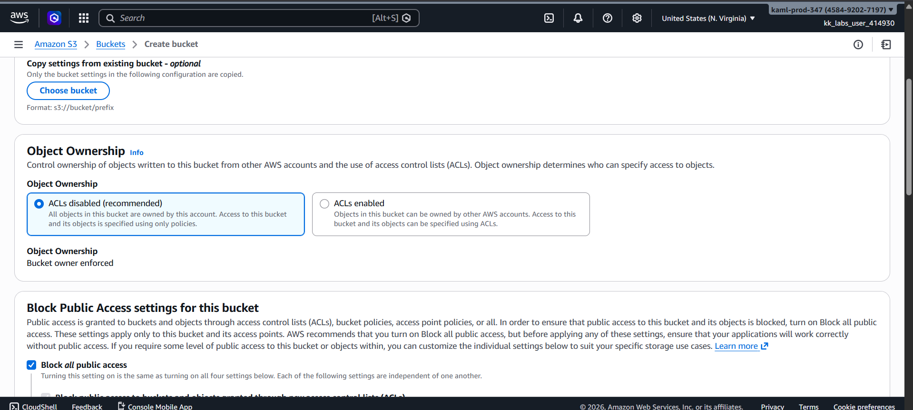
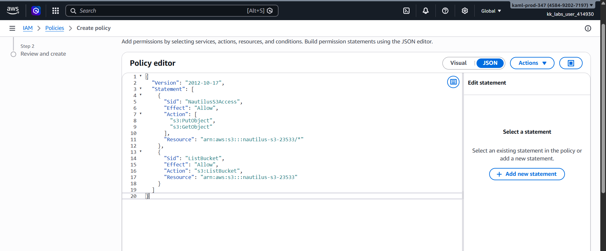
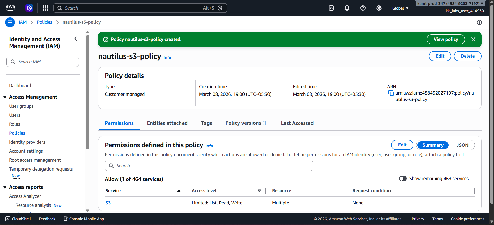
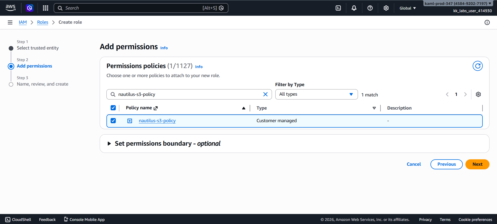
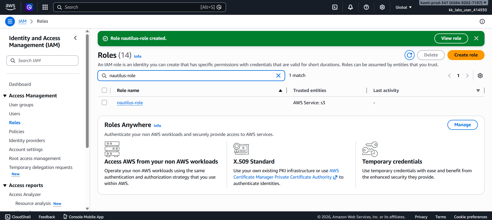
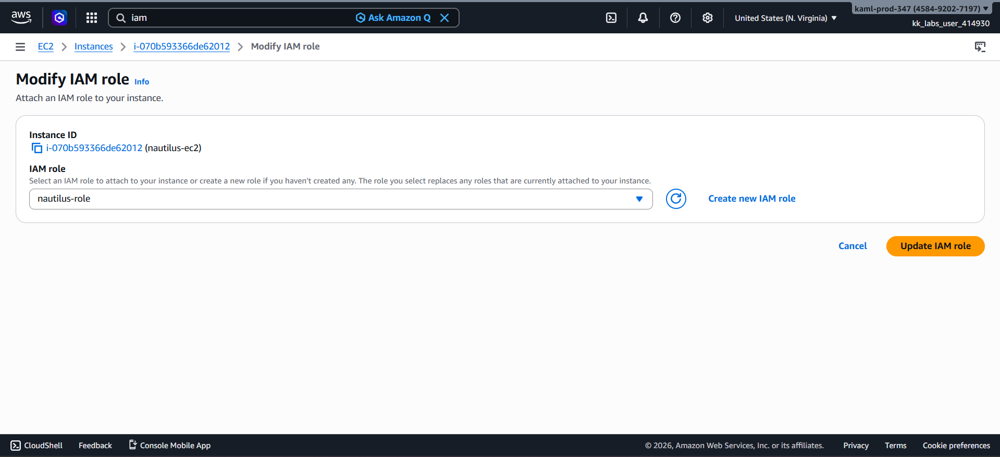
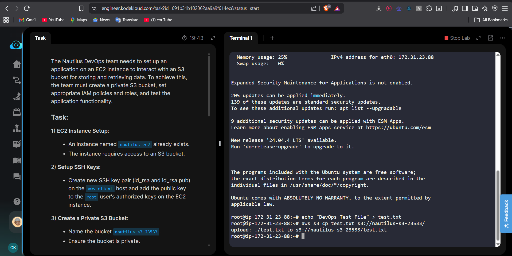
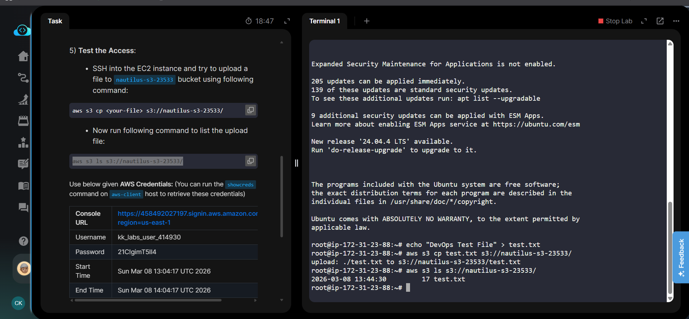
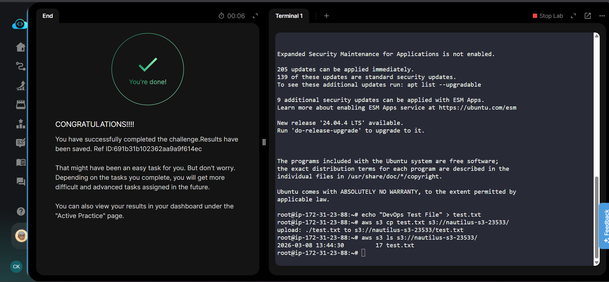

☁️ AWS DevOps Project: EC2 to S3 Secure Access using IAM Role
📌 Project Overview

This project demonstrates how to securely allow an EC2 instance to interact with an Amazon S3 bucket using IAM Roles and Policies instead of storing AWS credentials inside the server.

The setup includes creating a private S3 bucket, configuring IAM policies, attaching an IAM role to an EC2 instance, and testing file upload from the EC2 instance to the S3 bucket using the AWS CLI.

This architecture follows AWS security best practices by using temporary credentials via IAM roles.

🏗 Architecture
Internet / User
       │
       ▼
EC2 Instance (nautilus-ec2)
       │
       │ IAM Role (nautilus-role)
       ▼
IAM Policy (S3 Access Policy)
       │
       ▼
Private S3 Bucket (nautilus-s3-23533)
Workflow

Application runs on the EC2 instance.

EC2 assumes the IAM role attached to it.

IAM role grants permissions through the IAM policy.

The application uploads or retrieves files from the S3 bucket.

⚙️ Technologies Used

AWS EC2

Amazon S3

AWS IAM (Roles & Policies)

AWS CLI

Linux (Ubuntu)

SSH Key Authentication

🎯 Project Objectives

Allow EC2 instance to access an S3 bucket securely

Avoid storing AWS credentials on the server

Use IAM Role-based authentication

Test file upload using AWS CLI

🧩 Step 1: EC2 Instance

An EC2 instance already exists:

Property	Value
Instance Name	nautilus-ec2
Service	Amazon EC2
Purpose	Application server interacting with S3
🧩 Step 2: Generate SSH Keys

Generate SSH key pair on the aws-client host.

ssh-keygen -t rsa -b 2048

Generated files:

~/.ssh/id_rsa
~/.ssh/id_rsa.pub

Add the public key to the EC2 instance:

mkdir -p /root/.ssh
vi /root/.ssh/authorized_keys

Paste the contents of id_rsa.pub.

Set permissions:

chmod 700 /root/.ssh
chmod 600 /root/.ssh/authorized_keys
🧩 Step 3: Create Private S3 Bucket

Create a bucket named:

nautilus-s3-23533

Configuration:

Setting	Value
Bucket Type	Standard
Region	us-east-1
Public Access	Blocked

This ensures the bucket remains private and secure.

🧩 Step 4: Create IAM Policy

Create a policy allowing EC2 to interact with the S3 bucket.

Policy Permissions

s3:PutObject

s3:GetObject

s3:ListBucket

IAM Policy JSON
{
  "Version": "2012-10-17",
  "Statement": [
    {
      "Sid": "NautilusS3ObjectAccess",
      "Effect": "Allow",
      "Action": [
        "s3:PutObject",
        "s3:GetObject"
      ],
      "Resource": "arn:aws:s3:::nautilus-s3-23533/*"
    },
    {
      "Sid": "NautilusS3ListBucket",
      "Effect": "Allow",
      "Action": "s3:ListBucket",
      "Resource": "arn:aws:s3:::nautilus-s3-23533"
    }
  ]
}
🧩 Step 5: Create IAM Role

Create an IAM role named:

nautilus-role

Configuration:

Setting	Value
Trusted Entity	EC2
Attached Policy	nautilus-s3-policy

Purpose:

The EC2 instance will assume this role to access S3.

🧩 Step 6: Attach IAM Role to EC2

Attach the role to the instance:

EC2 → Instances → nautilus-ec2
Actions → Security → Modify IAM Role

Select:

nautilus-role

Update the instance role.

🧩 Step 7: SSH into EC2 Instance

Connect to the instance using SSH.

ssh root@<EC2-IP>

Verify AWS identity:

aws sts get-caller-identity
🧪 Step 8: Upload File to S3

Create a test file.

echo "DevOps Test File" > test.txt

Upload the file to the S3 bucket.

aws s3 cp test.txt s3://nautilus-s3-23533/

Expected output:

upload: ./test.txt to s3://nautilus-s3-23533/test.txt
🧪 Step 9: Verify File Upload

List the bucket contents.

aws s3 ls s3://nautilus-s3-23533/

Example output:

2026-03-08  test.txt
🔐 Security Best Practice Demonstrated

This project demonstrates an important AWS security principle:

Use IAM Roles instead of storing credentials on servers.

Benefits:

No hardcoded credentials

Temporary access tokens

Secure access management

Fine-grained permissions

📊 Key DevOps Concepts Demonstrated

IAM Roles and Policies

Secure EC2 to S3 communication

AWS CLI operations

SSH key-based authentication

Private S3 bucket configuration

Principle of Least Privilege

📷 Project Screenshots

(Add screenshots for portfolio)

## 📸 Project Screenshots

Below are screenshots from the implementation steps, in order:

EC2 Instance
images/ec2-instance.png
IAM Role
images/iam-role.png
IAM Policy
images/iam-policy.png
S3 Bucket
images/s3-bucket.png
File Upload Test
images/s3-upload.png
🎓 Learning Outcomes

Through this project I learned:

How to grant secure access from EC2 to S3

How IAM roles provide temporary credentials

How to apply least-privilege policies

How to interact with S3 using AWS CLI

Best practices for cloud security

🚀 Future Improvements

Automate infrastructure using Terraform

Add CloudWatch monitoring

Implement Auto Scaling Group

Use CI/CD pipeline for deployment