# 🚀 AWS ECS + ECR Container Deployment Project

This project demonstrates how to deploy a **containerized Python application** using **Amazon Elastic Container Registry (ECR)** and **Amazon Elastic Container Service (ECS)** with the **Fargate launch type**.

The goal of this project is to build a Docker image, push it to a private container registry, and deploy the containerized application using AWS managed container services.

---

# 📌 Project Architecture

```
Dockerfile
   │
   ▼
Docker Image
   │
   ▼
Amazon ECR (Private Repository)
   │
   ▼
Amazon ECS Cluster (Fargate)
   │
   ▼
Task Definition
   │
   ▼
ECS Service
   │
   ▼
Running Container
```

---

# 🧰 Technologies Used

* Docker
* Amazon ECR
* Amazon ECS
* AWS Fargate
* AWS IAM
* Python
* AWS CLI

---

# 📂 Project Workflow

The deployment process follows these steps:

1. Create a **private Amazon ECR repository**
2. Build a **Docker image** from the provided Dockerfile
3. Tag and push the Docker image to **Amazon ECR**
4. Create an **Amazon ECS cluster**
5. Define an **ECS Task Definition**
6. Deploy the container using **ECS Service**

---

# 1️⃣ Create Private ECR Repository

A private container registry was created in **Amazon Elastic Container Registry (ECR)**.

Repository Name:

```
datacenter-ecr
```

This repository stores the Docker images used by ECS.

---

# 2️⃣ Build Docker Image

Navigate to the application directory:

```bash
cd /root/pyapp
```

Build the Docker image:

```bash
docker build -t datacenter-app .
```

---

# 3️⃣ Authenticate Docker with ECR

```bash
aws ecr get-login-password --region us-east-1 \
| docker login \
--username AWS \
--password-stdin <account-id>.dkr.ecr.us-east-1.amazonaws.com
```

---

# 4️⃣ Tag Docker Image

```bash
docker tag datacenter-app:latest \
<account-id>.dkr.ecr.us-east-1.amazonaws.com/datacenter-ecr:latest
```

---

# 5️⃣ Push Docker Image to ECR

```bash
docker push \
<account-id>.dkr.ecr.us-east-1.amazonaws.com/datacenter-ecr:latest
```

The Docker image is now stored in **Amazon ECR**.

---

# 6️⃣ Create ECS Cluster

An ECS cluster was created using **AWS Fargate**.

Cluster Name:

```
datacenter-cluster
```

Fargate allows running containers **without managing EC2 instances**.

---

# 7️⃣ Create ECS Task Definition

Task Definition Name:

```
datacenter-taskdefinition
```

Configuration:

```
CPU: 0.5 vCPU
Memory: 1 GB
Container Image: datacenter-ecr:latest
```

This defines how the container should run inside ECS.

---

# 8️⃣ Deploy ECS Service

Service Name:

```
datacenter-service
```

Configuration:

```
Cluster: datacenter-cluster
Launch Type: Fargate
Desired Tasks: 1
```

The ECS service ensures that **at least one container task is always running**.

---

# ✅ Deployment Verification

After deployment, the ECS service successfully started a running task.

Verification steps:

* ECS Cluster Status
* Running Tasks
* Service Health

---

# 📸 Project Screenshots


Below are screenshots from the implementation steps, in order:

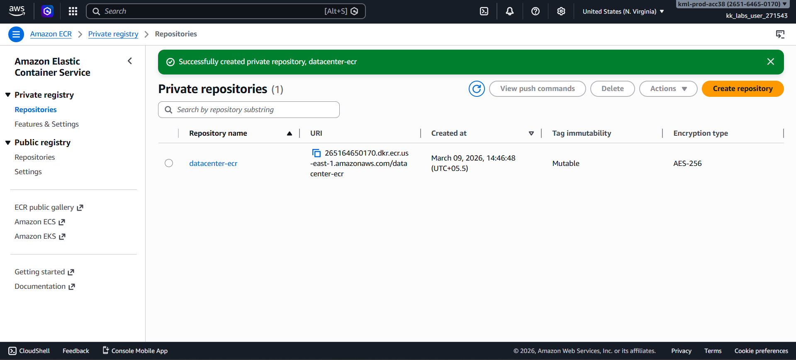

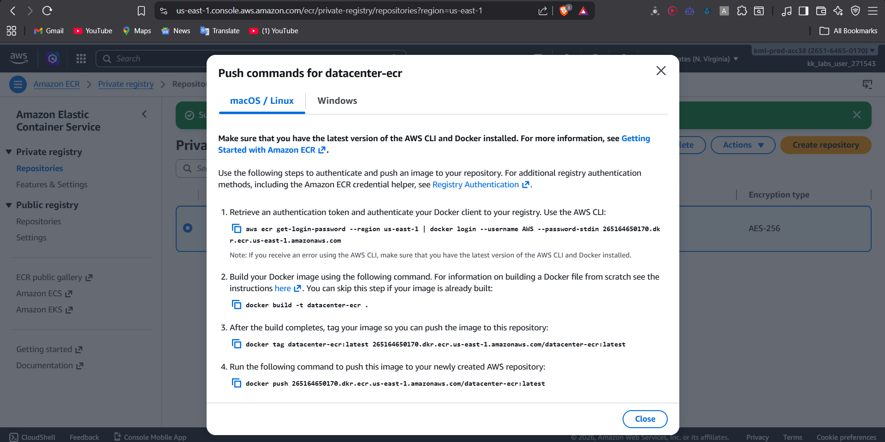

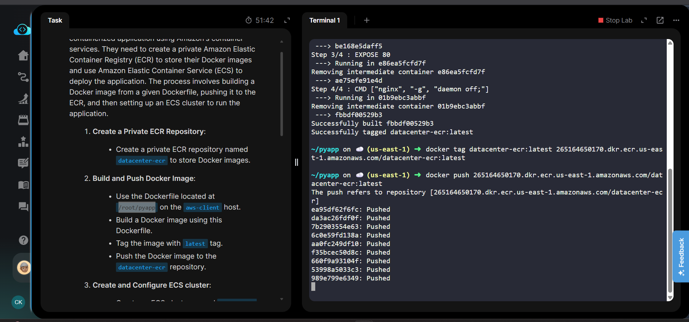

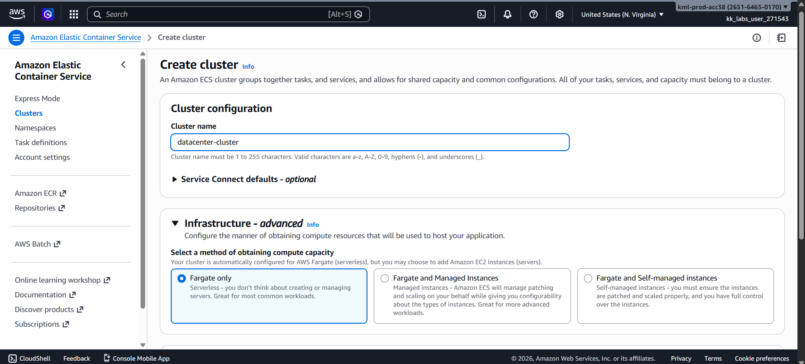

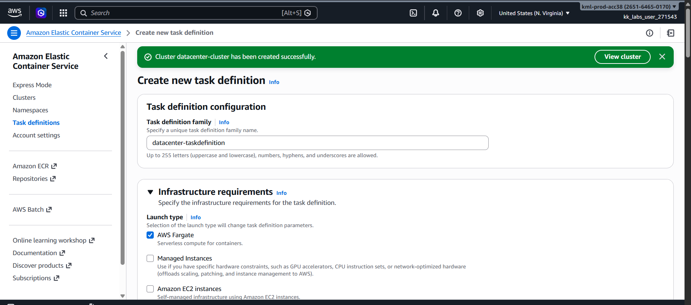

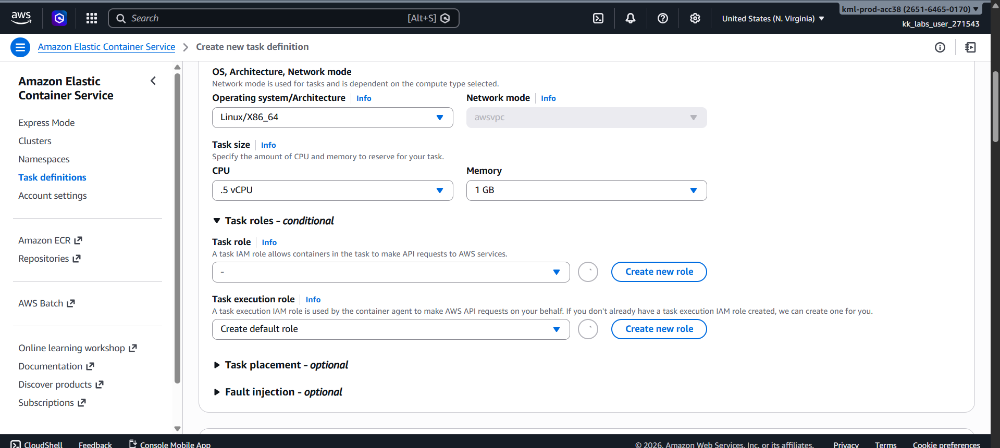

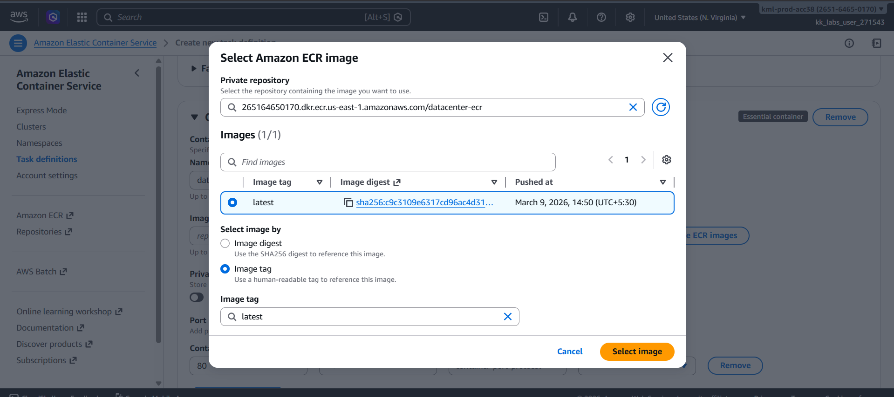

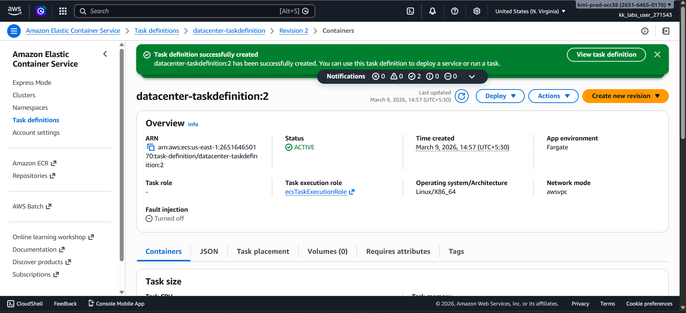

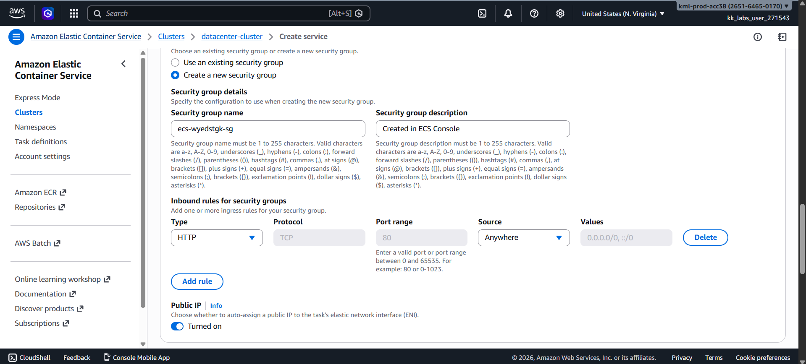

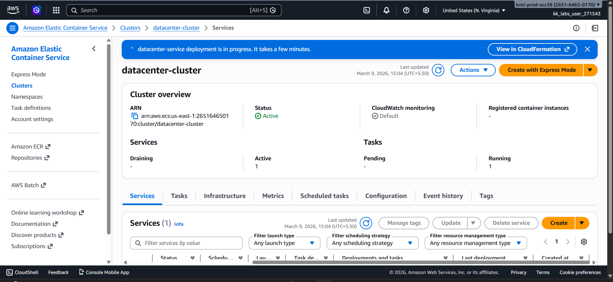

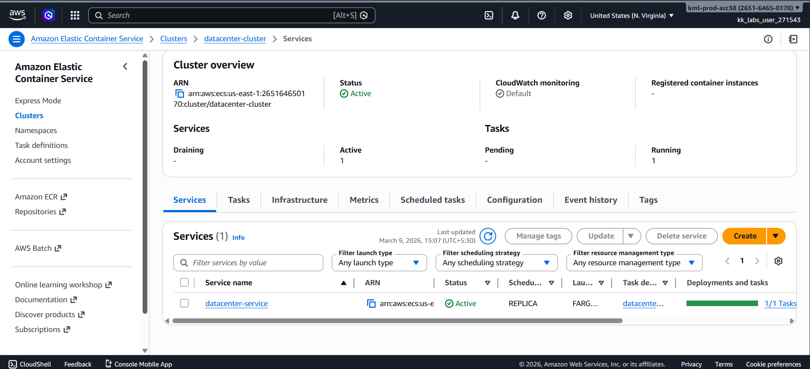

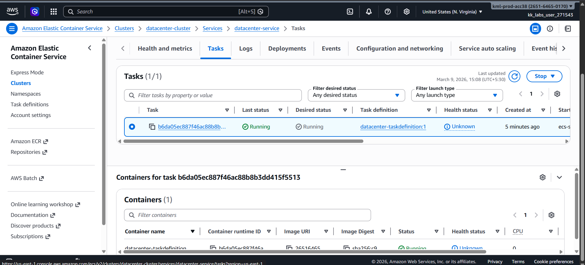

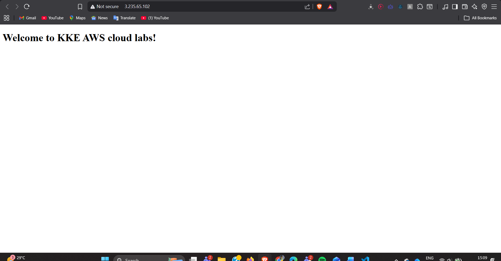
---

# 📊 Key Learnings

* Building Docker images from a Dockerfile
* Using **Amazon ECR** as a private container registry
* Deploying containers using **Amazon ECS**
* Running containers using **Fargate serverless compute**
* Managing container deployments with **ECS services**

---

# 🔮 Future Improvements

* Add **Application Load Balancer (ALB)**
* Implement **CI/CD pipeline using GitHub Actions**
* Add **Auto Scaling for ECS services**
* Monitor containers using **Amazon CloudWatch**

---

# 👨‍💻 Author

**Chandan Kumar**

DevOps | Cloud | Full Stack Developer

---

⭐ If you like this project, feel free to star the repository!
