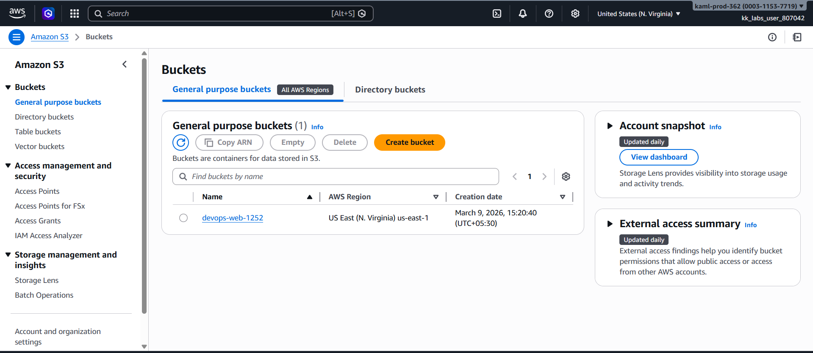
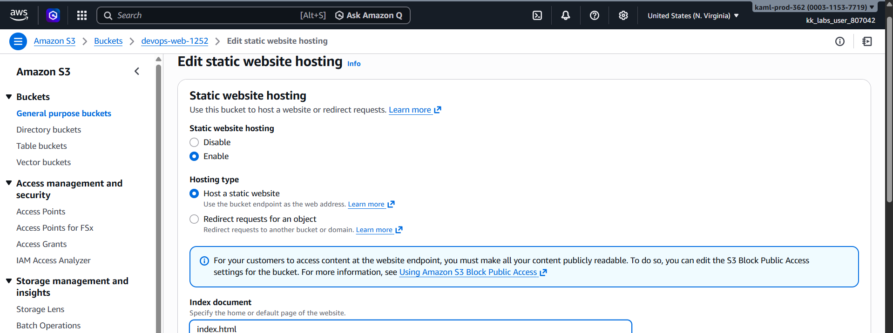
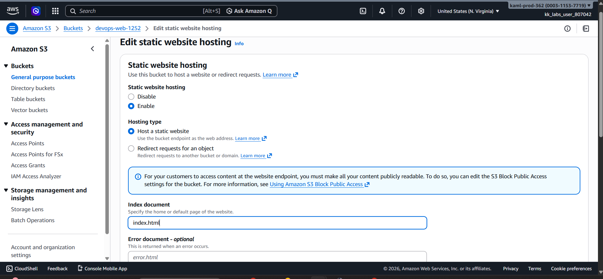
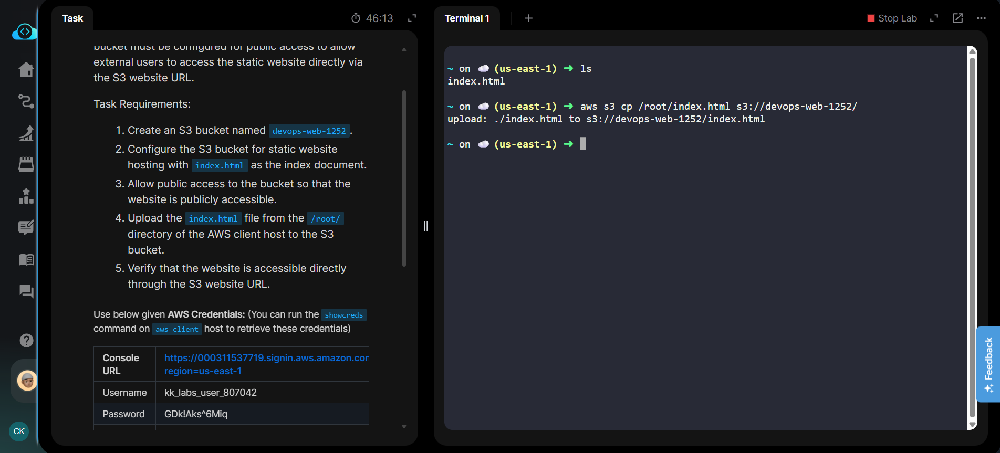
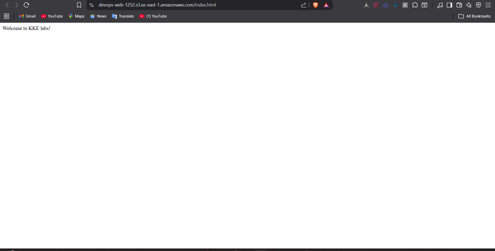

# 🌐 AWS S3 Static Website Hosting Project

This project demonstrates how to host a **static website on AWS using Amazon S3**. The objective was to configure an S3 bucket to serve a static HTML website and make it accessible publicly via the S3 website endpoint.

This project is part of my **DevOps hands-on learning and AWS practice labs**.

---

# 📌 Project Overview

The Nautilus DevOps team needed to create an **internal information portal for public access**.
To achieve this, we used **Amazon S3 Static Website Hosting** to deploy a simple web page.

The implementation included:

* Creating an S3 bucket
* Configuring static website hosting
* Enabling public access
* Uploading the website file
* Verifying access via the S3 website endpoint

---

# 🧰 Technologies Used

* Amazon S3
* AWS Management Console
* AWS CLI
* HTML
* IAM Policies

---

# 🏗️ Architecture

```
index.html
     │
     ▼
Amazon S3 Bucket
(devops-web-1252 / xfusion-web-5428)
     │
     ▼
Static Website Hosting Enabled
     │
     ▼
Public Access via S3 Website Endpoint
     │
     ▼
Users Access Website
```

---

# 🚀 Implementation Steps

## 1️⃣ Create S3 Bucket

A new S3 bucket was created.

```
Bucket Name: devops-web-1252
Region: us-east-1
```

The bucket is used to store static website files.

---

## 2️⃣ Disable Block Public Access

To allow public access to the website:

```
Permissions → Block Public Access
Disable: Block all public access
```

This allows objects inside the bucket to be publicly accessible.

---

## 3️⃣ Configure Static Website Hosting

Static website hosting was enabled in the bucket.

```
Properties → Static Website Hosting
Enable: Host a static website
Index document: index.html
```

---

## 4️⃣ Upload Website File

The HTML file was uploaded from the AWS client machine.

Example command:

```bash
aws s3 cp /root/index.html s3://devops-web-1252/
```

This uploads the webpage to the S3 bucket.

---

## 5️⃣ Configure Bucket Policy

To allow public read access to objects, the following policy was applied:

```json
{
  "Version": "2012-10-17",
  "Statement": [
    {
      "Sid": "PublicReadAccess",
      "Effect": "Allow",
      "Principal": "*",
      "Action": "s3:GetObject",
      "Resource": "arn:aws:s3:::devops-web-1252/*"
    }
  ]
}
```

---

## 6️⃣ Access the Static Website

After configuration, the website became accessible through the S3 website endpoint:

```
http://devops-web-1252.s3-website-us-east-1.amazonaws.com
```

Users can now access the hosted webpage directly.

---

# 📸 Project Screenshots

## S3 Bucket Created


## Static Website Hosting Enabled


## Bucket Policy Configuration


## Website Successfully Hosted


Below are screenshots from the implementation steps, in order:











# 📊 Key Learnings

Through this project I learned:

* How **Amazon S3 static website hosting works**
* Configuring **public access policies**
* Managing **S3 bucket permissions**
* Hosting **simple static websites on AWS**
* Understanding **AWS resource security configuration**

---

# 🔮 Future Improvements

Potential improvements for production-level deployments:

* Use **Amazon CloudFront CDN**
* Add **HTTPS with AWS Certificate Manager**
* Configure **custom domain using Route 53**
* Implement **CI/CD deployment for static sites**

---

# 👨‍💻 Author

**Chandan Kumar**

DevOps | Cloud | Full Stack Developer

---

⭐ If you find this project useful, feel free to **star the repository**.
